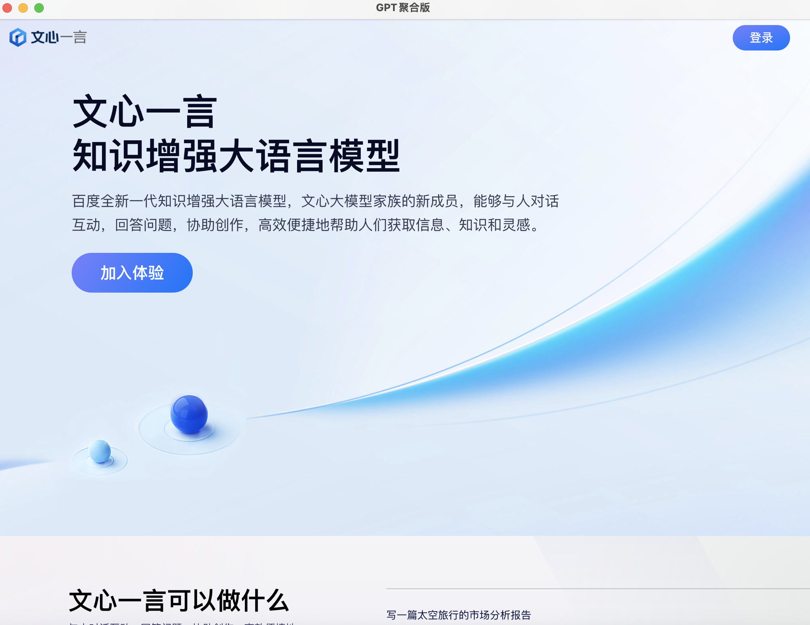
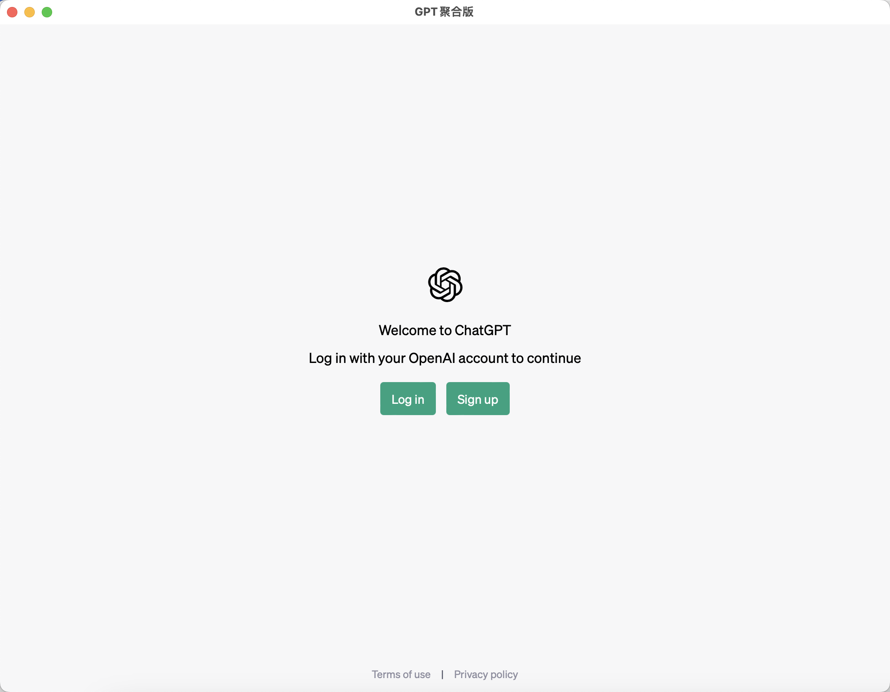
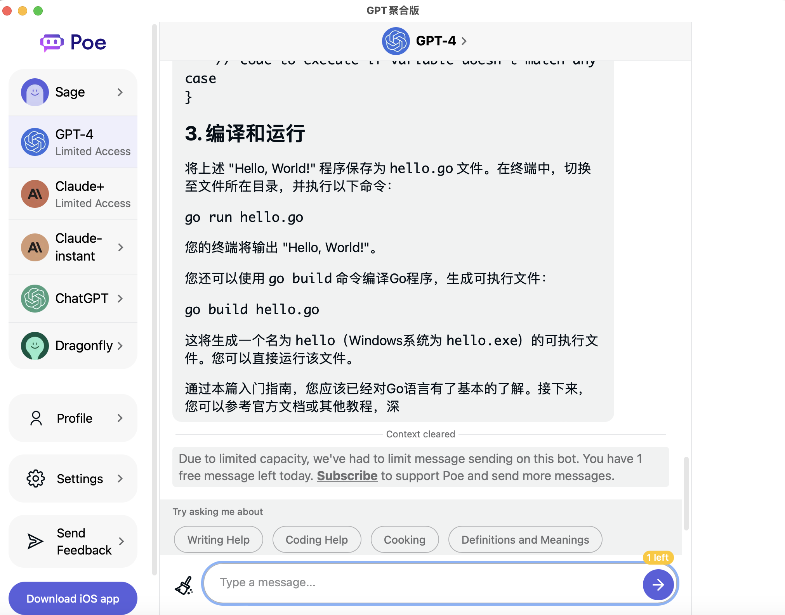
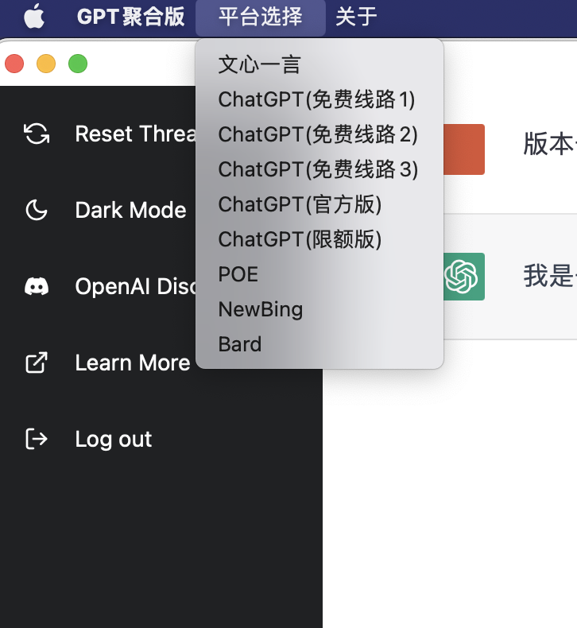
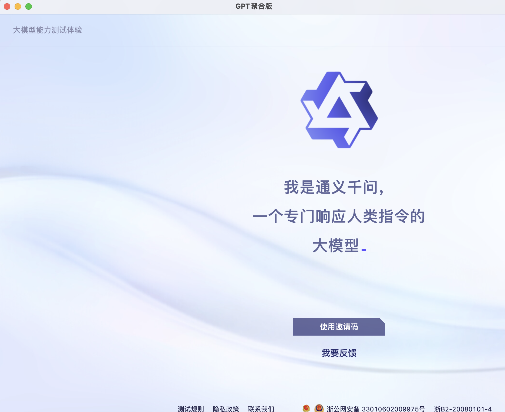
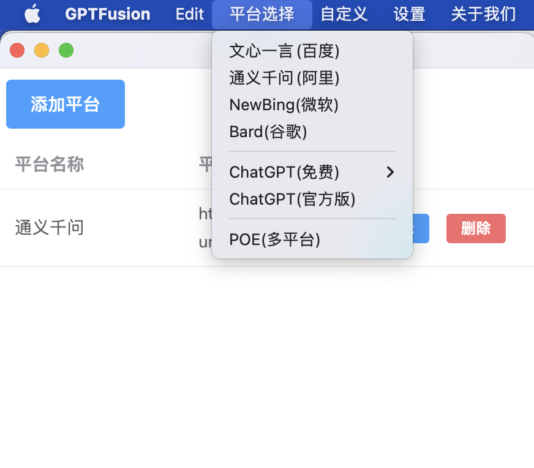
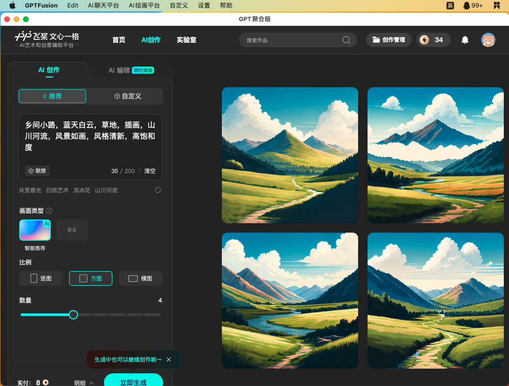
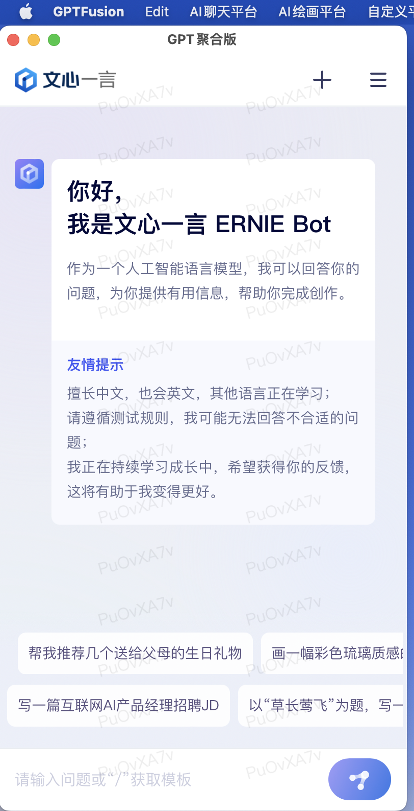

    
    <h1>GPTFusion - GPT聚合版</h1>
    
</img>
</img>
</img>
</img>

    <h4>Aggregate ChatGPT official version, ChatGPT free version, Wen Xin Yiyan, POE, chat chat and other platforms.</h4>

<strong>
<samp>

[简体中文](README.md) · [English](README.en.md)

</samp>
</strong>

## About

GPT Aggregator is a chat tool that aggregates multiple GPT chatbots.

## Feature
- [x] Cross-platform support
- [x] Customize the platform menu
- [x] Menu dynamic loading (Windows)
- [x] Check for updates
- [x] Built-in platform classification
- [ ] Menu dynamic loading (Linux) is not currently supported
- [ ] Dynamic menu loading (macOS) is not currently supported
- [ ] More features

#### Converged platform

##### Official version of ChatGPT
You need to register an account, you need to log in to the official account (it is not recommended to visit non-US regions)

##### ChatGPT free version
No need to register an account, no need to log in to the account, stable and fast (some countries and regions cannot access normally) Built-in 3 domestic images, you can add your own images to the custom platform menu through the custom platform function.

##### ChatChat
No need to register an account, no need to log in to the account, stable speed, daily limit, can be accessed normally.

##### POE
Account registration required, login required, Collection Sage (free), ChatGPT4 (paid), ChatGPT (paid), Clude (free), Clude+ (paid), DragonFly (free) (not accessible in some countries and regions) Google account login is recommended

##### 文心一言
You need to be qualified and must log in to your Baidu account (you may not remember the login status when you scan the login)

##### 通义千问
An invitation code is required

##### Bard
Eligible and signed in to a Google Account (not accessible in all countries and regions)

##### Newbing
Must be qualified and must log in to Microsoft account (domestic IP cannot be jumped normally)

## Screenshot

## Thanks

- Idea: [OneGPT - GPT聚合版](https://github.com/1595901624/gpt-aggregated-edition)
- [wails](https://github.com/wailsapp/wails)

## Building

To build a redistributable, production mode package, use `wails build`.

## Installation instructions

- macos
  - Download the GPTFusion.xxx .dmg installation package, double-click to install. (Recommended)
  - Download the GPTFusion .app.zip package, unzip and drag it into the Applications folder.
  - If it can't be opened, go to Security & Privacy in Settings, and then click Allow to open
- windows
  - Download the .exe installation package, double-click to execute (the installation version is changed to the green version, open and use directly)
- linux
  - `sudo chmod +x GPTFusion.AppImage` Add executable permissions and double-click Run

## Instructions for use

- You can add the mirror station you want to add through the (Settings - Platform Management) menu custom menu function, and the added content will automatically appear in the custom menu after the addition is completed (macOS and Linux need to manually restart the software to take effect).

## Feedback

- GitHub issue
- **Go学习日记** WeChat public account

**Scan the code to follow the public account**

## Donation

| Wechat  | Alipay |
| --- | --- |
|  |  |